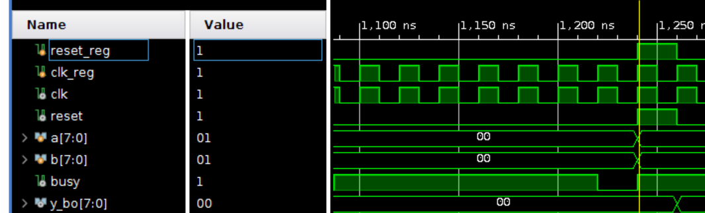
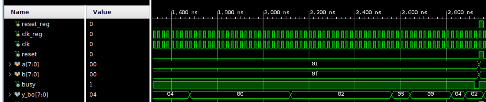
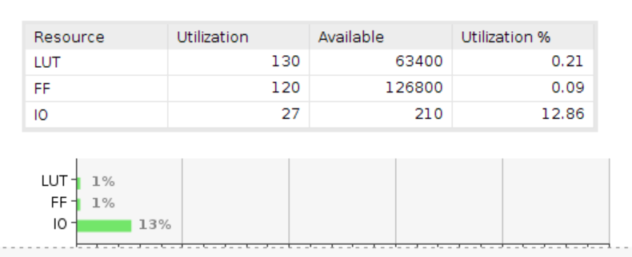
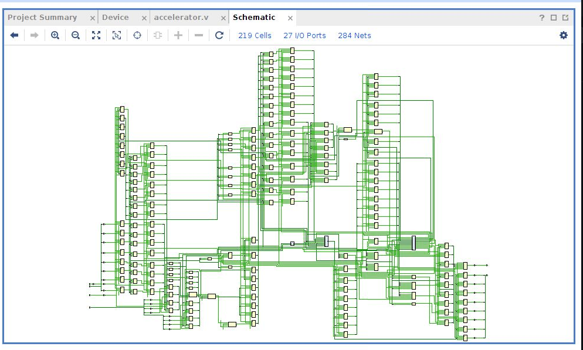

# Лабораторная работа №2 &laquo;Функциональная схемотехника&raquo;

Выполнили: Прикота В.А Суркис А.И.

Преподаватель: Тищук Б.Ю.

Санкт-Петербург, 2021

Задание
=======

- Разработайте и опишите на Verilog HDL схему, вычисляющую значение функции в соответствии с заданными ограничениями согласно варианту задания.
- Определите область допустимых значений функции.
- Разработайте тестовое окружение для разработанной схемы. Тестовое окружение должно проверять работу схемы не менее, чем на 10 различных тестовых векторах.
- Проведите моделирование работы схемы и определите время вычисления результата. Схема должна тактироваться от сигнала с частотой 100 МГц.


Вариант
=======

<!-- -  -->
- `( a + b ^ (1/3) ) ^ (1/2)`
- 2 сумматора и 1 умножитель

Конечный автомат для алгоритма вычисления функции
===================


Описание работы алгоритма
===================

1. Бинарный поиск кубического корня из `b`. Т.к. 0 &leq; `b` &leq; 255, то 0 &leq; `b ^ (1/3)` < 7.
   Следовательно, мы гарантированно не ошибемся, если будем искать от 0 до 7 включительно.
   Алгоритм, описанный в методичке, ошибочный, т.к. там 2 раза представлен алгоритм поиска квадратного корня.
1. Сложение `a` с результатом поиска;
1. Поиск квадратного корня от результата сложения по алгоритму из методички.

Описание модуля на языке Verilog HDL
====================================
`accelerator.v`

Тестовое окружение
==================
`test.v`


Описание окружения и результаты тестирования
--------------------------------------------
Тестировать будем так - каждый такт нашего &laquo;генератора&raquo; будем проверять не освободился ли вычислительный модуль, если нет, то ждем дальше, если он свободен, то подаем на вход новые значения. Результаты тестирования представлены ниже.
```
floor sqrt (   0 + floor cbrt   0 ) = 0
floor sqrt (   1 + floor cbrt   1 ) = 1
floor sqrt (   2 + floor cbrt   2 ) = 1
floor sqrt (   3 + floor cbrt   3 ) = 2
floor sqrt (   4 + floor cbrt   4 ) = 2
floor sqrt (   5 + floor cbrt   5 ) = 2

floor sqrt (   0 + floor cbrt   0 ) = 0
floor sqrt (   1 + floor cbrt  15 ) = 0
floor sqrt (   2 + floor cbrt  30 ) = 0
floor sqrt (   3 + floor cbrt  45 ) = 0
```
<!-- 
 -->

Временная диаграмма
===================
Ниже представлены временные диаграммы для первого и второго тестов. Из первой диагрммы видно, что на вычисление одного значения (при тактовой частоте 100 МГц) уходит 1240 нс.




Потребление ресурсов на FPGA
============================

Замеры потребления ресурсов FPGA были сделаны в симуляторе Vivaldo.



Схема устройства
========================



Вывод
=====

В ходе выполнения работы была создана комбинационная схема ускоретиля математических вычислений.
