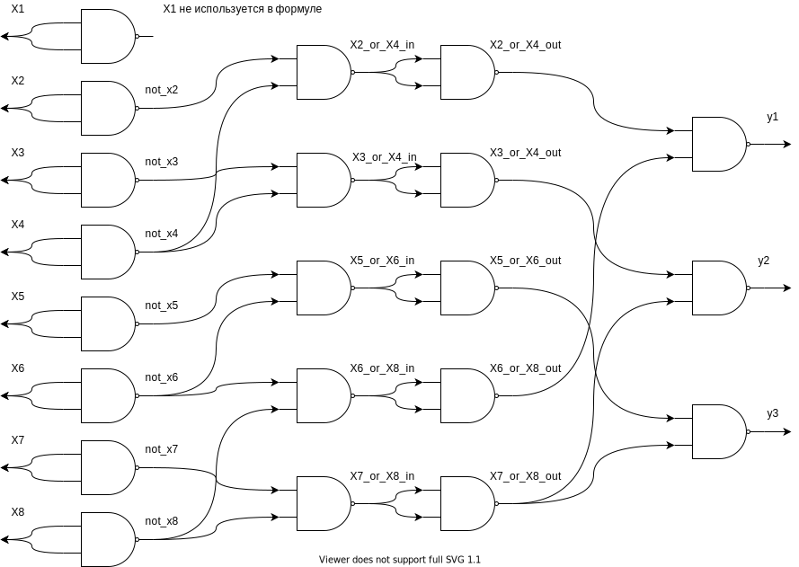
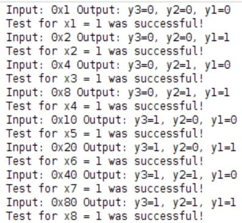

<!-- федеральное государственное автономное образовательное учреждение высшего образования
«Национальный исследовательский университет ИТМО» -->

# Лабораторная работа №1 &laquo;Функциональная схемотехника&raquo;

Выполнили: Прикота В.А Суркис А.И.

Преподаватель: Тищук Б.Ю.

Санкт-Петербург, 2021

Задание
=======

-   Описать на Verilog HDL на вентильном уровне модуль, реализующий
    функцию БОЭ в указанном логическом базисе согласно варианту задания.
-   Разработать тестовое окружение для созданного модуля.
-   Провести моделирование работы схемы.

Вариант
=======

-   Позиционный шифратор «8 в 3»
-   Базис - NAND

Схема и ее описание
===================


<!-- ![Схема позиционного шифратора 8 в 3, реализованного на базисе NAND
логики[]{label="ris:image"}](https://i.imgur.com/eW4RyQl.png) -->

Данной выше схемой реализуется логическая формула:

```
y1 = x2 | x4 | x6 | x8
y2 = x3 | x4 | x7 | x8
y3 = x5 | x6 | x7 | x8
```
<!-- $$y_1 = x_2 \lor x_4 \lor x_6 \lor x_8$$
$$y_2 = x_3 \lor x_4 \lor x_7 \lor x_8$$
$$y_3 = x_5 \lor x_6 \lor x_7 \lor x_8$$ -->

Описание модуля на языке Verilog HDL
====================================

`circuit.v`
<!-- ``` {.verilog language="Verilog" basicstyle="\small"}
`timescale 1ns / 1ps

module circuit(
    input x1,
    input x2,
    input x3,
    input x4,
    input x5,
    input x6,
    input x7,
    input x8,
    output y1,
    output y2,
    output y3
    );
    
    
    wire not_x2, not_x3, not_x4, not_x5, not_x6, not_x7, not_x8;
    
    nand(not_x2, x2, x2);
    nand(not_x3, x3, x3);
    nand(not_x4, x4, x4);
    nand(not_x5, x5, x5);
    nand(not_x6, x6, x6);
    nand(not_x7, x7, x7);
    nand(not_x8, x8, x8);
    
    wire x2_or_x4_in, x3_or_x4_in, x5_or_x6_in, x6_or_x8_in, x7_or_x8_in;
    
    nand(x2_or_x4_in, not_x2, not_x4);
    nand(x3_or_x4_in, not_x3, not_x4);
    nand(x5_or_x6_in, not_x5, not_x6);
    nand(x6_or_x8_in, not_x6, not_x8);
    nand(x7_or_x8_in, not_x7, not_x8);
    
    wire x2_or_x4_out, x3_or_x4_out, x5_or_x6_out, x6_or_x8_out, x7_or_x8_out;
    
    nand(x2_or_x4_out, x2_or_x4_in, x2_or_x4_in);
    nand(x3_or_x4_out, x3_or_x4_in, x3_or_x4_in);
    nand(x5_or_x6_out, x5_or_x6_in, x5_or_x6_in);
    nand(x6_or_x8_out, x6_or_x8_in, x6_or_x8_in);
    nand(x7_or_x8_out, x7_or_x8_in, x7_or_x8_in);
    
    
    nand(y1, x2_or_x4_out, x6_or_x8_out);
    nand(y2, x3_or_x4_out, x7_or_x8_out);
    nand(y3, x5_or_x6_out, x7_or_x8_out);
    
endmodule
``` -->

Тестовое окружение
==================

Код на языке Verilog HDL
------------------------

`circuit_test.v`
<!-- ``` {.verilog language="Verilog" basicstyle="\small"}
`timescale 1ns / 1ps

module circuit_test;
    
    reg[7:0] x;
    wire y1, y2, y3;
    
    circuit circuit_1(
        .x1(x[0]),
        .x2(x[1]),
        .x3(x[2]),
        .x4(x[3]),
        .x5(x[4]),
        .x6(x[5]),
        .x7(x[6]),
        .x8(x[7]),
        .y1(y1),
        .y2(y2),
        .y3(y3)
    );
    
    integer i = 0;
    initial begin
        for (i = 0; i < 8; i = i + 1) begin
            x = 2**i;
            
            #10
            
            $display("Input: 0x%0h Output: y3=%b, y2=%b, y1=%b",x, y3, y2, y1); 
            if (i == 0 && y3 == 0 && y2 == 0 && y1 == 0) begin
                $display("Test for x1 = 1 was successful!");
            end 
            
            if (i == 1 && y3 == 0 && y2 == 0 && y1 == 1) begin
                $display("Test for x2 = 1 was successful!");
            end
            
            if (i == 2 && y3 == 0 && y2 == 1 && y1 == 0) begin
                $display("Test for x3 = 1 was successful!");
            end 
            
            if (i == 3 && y3 == 0 && y2 == 1 && y1 == 1) begin
                $display("Test for x4 = 1 was successful!");
            end
            
            if (i == 4 && y3 == 1 && y2 == 0 && y1 == 0) begin
                $display("Test for x5 = 1 was successful!");
            end
            
            if (i == 5 && y3 == 1 && y2 == 0 && y1 == 1) begin
                $display("Test for x6 = 1 was successful!");
            end
            
            if (i == 6 && y3 == 1 && y2 == 1 && y1 == 0) begin
                $display("Test for x7 = 1 was successful!");
            end
            
            if (i == 7 && y3 == 1 && y2 == 1 && y1 == 1) begin
                $display("Test for x8 = 1 was successful!");
            end
        end  
        // Zeroing x for pretty time diagram
        x = 0;
    end
    
endmodule
``` -->

Описание окружения и результаты тестирования
--------------------------------------------

Тестировать будем в цикле, каждый раз подавая 1 на один из входов и на
остальные 0. Входной сигнал будет аналогичен поступлению на 8-битовую
шину числа, которое является степенью двойки.  
Т.е. число `4_10` это будет `00000100_2` Это означает, что сигнал
поступил на 3-ю линию и выход на схеме будет иметь такое значение:
`010_2` - это означает 2 вход (если считать, что входы размечены от 0
до 7) или 3 вход (если от 1 до 8).

```
Input: 0x1 Output: y3=0, y2=0, y1=0
Test for x1 = 1 was successful!
Input: 0x2 Output: y3=0, y2=0, y1=1
Test for x2 = 1 was successful!
Input: 0x4 Output: y3=0, y2=1, y1=0
Test for x3 = 1 was successful!
Input: 0x8 Output: y3=0, y2=1, y1=1
Test for x4 = 1 was successful!
Input: 0x10 Output: y3=1, y2=0, y1=0
Test for x5 = 1 was successful!
Input: 0x20 Output: y3=1, y2=0, y1=1
Test for x6 = 1 was successful!
Input: 0x40 Output: y3=1, y2=1, y1=0
Test for x7 = 1 was successful!
Input: 0x80 Output: y3=1, y2=1, y1=1
Test for x8 = 1 was successful!
```
<!--  -->
<!-- ![Вывод результатов
тестирования[]{label="ris:image"}](https://i.imgur.com/ZvTaFwg.jpg) -->

Временная диаграмма
===================

Время задержки между подачей нового сигнала составляет 10 нс.


<!-- ![Временная диаграмма для тестого
окружения[]{label="ris:image"}](https://i.imgur.com/KkH6MVL.jpg) -->

Потребление ресурсов на FPGA
============================

Замеры потребления ресурсов FPGA были сделаны в симуляторе Vivaldo.


<!-- ![Вывод результатов
тестирования[]{label="ris:image"}](https://i.imgur.com/qv8NBmJ.png) -->

Вывод
=====

В ходе выполнения работы была создана комбинационная схема позиционного
шифратора &laquo;8 в 3&raquo; и описана на языке Verilog HDL в среде разработки
Vivaldo. Также были получены базовые навыки работы с этой средой и
тестирования созданных схем.
